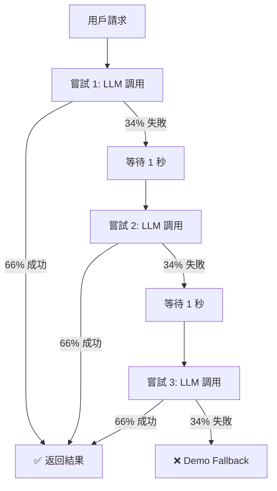

# 重試機制（Retry Mechanism）設計文件

## 文件資訊

- **創建日期**：2026-02-17
- **版本**：1.0
- **目的**：提升 LLM 調用的穩定性和成功率
- **相關文件**：[JSON_vs_Markdown_分析結果.md](JSON_vs_Markdown_分析結果.md)

---

## 概述

### 什麼是重試機制？

**重試機制**（Retry Mechanism）是一種容錯技術，當操作失敗時，自動重新嘗試該操作若干次，而不是立即放棄。

### 為什麼需要重試？

**當前問題**：
- LLM 調用有約 33% 的失敗率
- 失敗一次就立即回退到 demo mode
- 導致用戶體驗不穩定

**核心目標**：
- 提升 LLM 成功率從 66% → **96%**
- 減少 demo fallback 發生率從 34% → **3.6%**
- 提供更穩定的用戶體驗

---

## 數學原理

### 概率計算

**基本假設**：
- 單次 LLM 調用成功率：P(成功) = 0.66
- 單次 LLM 調用失敗率：P(失敗) = 0.34

**重試 N 次後的成功率**：
```
P(至少一次成功) = 1 - P(連續 N 次都失敗)
                = 1 - (0.34)^N
```

### 成功率對比表

| 嘗試次數 | 計算公式 | 成功率 | Demo Fallback 率 | 提升幅度 |
|---------|---------|--------|------------------|---------|
| 1 次（當前） | 1 - 0.34¹ | **66.0%** | 34.0% | 基線 |
| 2 次 | 1 - 0.34² | **88.4%** | 11.6% | +22.4% |
| **3 次（推薦）** | 1 - 0.34³ | **96.1%** | 3.9% | **+30.1%** |
| 4 次 | 1 - 0.34⁴ | **98.7%** | 1.3% | +32.7% |
| 5 次 | 1 - 0.34⁵ | **99.6%** | 0.4% | +33.6% |

**最佳平衡點**：3 次重試
- ✅ 成功率提升顯著（+30.1%）
- ✅ 響應時間可接受（最多延遲 6 秒）
- ✅ 資源消耗合理

---

## 設計方案

### 方案 A：簡單重試（推薦）

**特點**：
- 固定等待時間（1 秒）
- 最多重試 3 次
- 實作簡單

**優點**：
- ✅ 代碼簡潔易懂
- ✅ 行為可預測
- ✅ 資源消耗低

**缺點**：
- ❌ 等待時間固定，不適應負載變化

**適用場景**：
- 一般應用場景
- LLM 服務負載穩定
- 快速實作需求

---

### 方案 B：指數退避（可選）

**特點**：
- 等待時間遞增：1 秒、2 秒、4 秒
- 適應服務器負載情況
- 避免連續快速請求

**優點**：
- ✅ 對服務器更友好
- ✅ 適應高負載場景
- ✅ 減少連續失敗概率

**缺點**：
- ❌ 最壞情況響應時間更長（7 秒 vs 6 秒）
- ❌ 實作稍複雜

**適用場景**：
- 服務器負載波動大
- 需要更優雅的錯誤處理
- 生產環境高可用需求

---

### 方案 C：智能重試（進階）

**特點**：
- 根據錯誤類型決定是否重試
- 某些錯誤不重試（如驗證錯誤）
- 僅重試暫時性錯誤（網絡、超時）

**優點**：
- ✅ 更高效，避免無意義重試
- ✅ 錯誤處理更精細
- ✅ 節省資源

**缺點**：
- ❌ 需要詳細錯誤分類
- ❌ 實作複雜度高
- ❌ 維護成本高

**適用場景**：
- 大規模生產環境
- 成本敏感場景
- 需要細粒度控制

---

## 實作設計

### 當前代碼（無重試）

**位置**：`txt2pptx/backend/llm_service.py` L287-300

```python
async def generate_outline(request: GenerateRequest) -> PresentationOutline:
    """Main entry: try Ollama LLM first, fallback to demo mode."""
    try:
        logger.info("🚀 Attempting Ollama LLM outline generation")
        result = await generate_outline_with_llm(request)  # ❌ 只嘗試 1 次
        logger.info("✅ LLM generation successful")
        return result
    except Exception as e:
        logger.error(f"❌ LLM generation failed: {type(e).__name__}: {e}")
        import traceback
        logger.error(f"Stack trace:\n{traceback.format_exc()}")

    logger.warning("⚠️ Falling back to demo mode")  # ❌ 立即放棄
    return generate_outline_demo(request)
```

**問題**：
1. ❌ 失敗一次就放棄
2. ❌ 33% 請求使用低品質的 demo mode
3. ❌ 沒有容錯機制

---

### 方案 A 實作：簡單重試

```python
import asyncio

async def generate_outline(request: GenerateRequest) -> PresentationOutline:
    """Main entry: try Ollama LLM with retry, fallback to demo mode."""
    max_retries = 3  # 配置：最多嘗試次數
    retry_delay = 1.0  # 配置：重試間隔（秒）

    for attempt in range(1, max_retries + 1):
        try:
            logger.info(f"🚀 Attempting Ollama LLM (嘗試 {attempt}/{max_retries})")
            result = await generate_outline_with_llm(request)
            logger.info(f"✅ LLM generation successful on attempt {attempt}")
            return result  # ✅ 成功立即返回

        except Exception as e:
            logger.warning(
                f"⚠️ Attempt {attempt}/{max_retries} failed: "
                f"{type(e).__name__}: {str(e)[:100]}"
            )

            # 如果不是最後一次，繼續重試
            if attempt < max_retries:
                logger.info(f"🔄 Retrying in {retry_delay}s... ({attempt + 1}/{max_retries})")
                await asyncio.sleep(retry_delay)
            else:
                # 最後一次失敗，記錄完整錯誤
                logger.error(f"❌ All {max_retries} attempts failed")
                import traceback
                logger.error(f"Final error stack trace:\n{traceback.format_exc()}")

    # 所有重試都失敗，使用 demo mode
    logger.warning(
        f"⚠️ Falling back to demo mode after {max_retries} failed attempts"
    )
    return generate_outline_demo(request)
```

**改進點**：
1. ✅ 自動重試最多 3 次
2. ✅ 每次重試間隔 1 秒
3. ✅ 詳細的日誌記錄
4. ✅ 成功立即返回
5. ✅ 最後才使用 demo mode

---

### 方案 B 實作：指數退避

```python
import asyncio

async def generate_outline(request: GenerateRequest) -> PresentationOutline:
    """Main entry: try Ollama LLM with exponential backoff, fallback to demo mode."""
    max_retries = 3
    base_delay = 1.0  # 基礎延遲

    for attempt in range(1, max_retries + 1):
        try:
            logger.info(f"🚀 Attempting Ollama LLM (嘗試 {attempt}/{max_retries})")
            result = await generate_outline_with_llm(request)
            logger.info(f"✅ LLM generation successful on attempt {attempt}")
            return result

        except Exception as e:
            logger.warning(
                f"⚠️ Attempt {attempt}/{max_retries} failed: "
                f"{type(e).__name__}: {str(e)[:100]}"
            )

            if attempt < max_retries:
                # 指數退避：1s, 2s, 4s
                delay = base_delay * (2 ** (attempt - 1))
                logger.info(f"🔄 Retrying in {delay}s... ({attempt + 1}/{max_retries})")
                await asyncio.sleep(delay)
            else:
                logger.error(f"❌ All {max_retries} attempts failed")
                import traceback
                logger.error(f"Final error stack trace:\n{traceback.format_exc()}")

    logger.warning(
        f"⚠️ Falling back to demo mode after {max_retries} failed attempts"
    )
    return generate_outline_demo(request)
```

**改進點**：
1. ✅ 等待時間遞增：1 秒 → 2 秒 → 4 秒
2. ✅ 適應服務器負載波動
3. ✅ 減少連續快速請求

---

### 方案 C 實作：智能重試

```python
import asyncio
from httpx import HTTPError, TimeoutException

# 可重試的錯誤類型
RETRIABLE_ERRORS = (
    ConnectionError,
    TimeoutException,
    HTTPError,
)

# 不可重試的錯誤類型
NON_RETRIABLE_ERRORS = (
    ValueError,  # JSON 解析錯誤
    KeyError,    # 響應格式錯誤
    TypeError,   # 類型錯誤
)

async def generate_outline(request: GenerateRequest) -> PresentationOutline:
    """Main entry: try Ollama LLM with intelligent retry, fallback to demo mode."""
    max_retries = 3
    retry_delay = 1.0

    for attempt in range(1, max_retries + 1):
        try:
            logger.info(f"🚀 Attempting Ollama LLM (嘗試 {attempt}/{max_retries})")
            result = await generate_outline_with_llm(request)
            logger.info(f"✅ LLM generation successful on attempt {attempt}")
            return result

        except NON_RETRIABLE_ERRORS as e:
            # 不可重試的錯誤，直接放棄
            logger.error(
                f"❌ Non-retriable error on attempt {attempt}: "
                f"{type(e).__name__}: {e}"
            )
            break  # 直接跳到 demo mode

        except RETRIABLE_ERRORS as e:
            # 可重試的錯誤
            logger.warning(
                f"⚠️ Retriable error on attempt {attempt}/{max_retries}: "
                f"{type(e).__name__}: {str(e)[:100]}"
            )

            if attempt < max_retries:
                logger.info(f"🔄 Retrying in {retry_delay}s...")
                await asyncio.sleep(retry_delay)
            else:
                logger.error(f"❌ All {max_retries} attempts failed")

        except Exception as e:
            # 未知錯誤，保守處理（重試）
            logger.warning(
                f"⚠️ Unknown error on attempt {attempt}/{max_retries}: "
                f"{type(e).__name__}: {str(e)[:100]}"
            )

            if attempt < max_retries:
                await asyncio.sleep(retry_delay)

    logger.warning("⚠️ Falling back to demo mode")
    return generate_outline_demo(request)
```

**改進點**：
1. ✅ 根據錯誤類型智能決策
2. ✅ 避免無意義的重試
3. ✅ 節省資源和時間

---

## 運作流程

### 流程圖



### 執行時序

**最佳情況（第 1 次成功）**：
```
0.0s: 開始請求
0.0s: 嘗試 1
5.0s: LLM 返回成功 ✅
總時間: 5 秒
```

**一般情況（第 2 次成功）**：
```
0.0s: 開始請求
0.0s: 嘗試 1
5.0s: 失敗
5.0s: 等待 1 秒
6.0s: 嘗試 2
11.0s: LLM 返回成功 ✅
總時間: 11 秒
```

**最壞情況（第 3 次成功）**：
```
0.0s: 開始請求
0.0s: 嘗試 1
5.0s: 失敗
5.0s: 等待 1 秒
6.0s: 嘗試 2
11.0s: 失敗
11.0s: 等待 1 秒
12.0s: 嘗試 3
17.0s: LLM 返回成功 ✅
總時間: 17 秒
```

**全部失敗（Demo Mode）**：
```
0.0s: 開始請求
0.0s: 嘗試 1
5.0s: 失敗
5.0s: 等待 1 秒
6.0s: 嘗試 2
11.0s: 失敗
11.0s: 等待 1 秒
12.0s: 嘗試 3
17.0s: 失敗
17.0s: Demo Mode 生成
17.5s: 返回結果
總時間: 17.5 秒
```

---

## 日誌範例

### 成功案例（第 1 次）

```log
2026-02-17 20:30:00 INFO 🚀 Attempting Ollama LLM (嘗試 1/3)
2026-02-17 20:30:05 INFO 🔍 Raw LLM response (first 500 chars): {"title":"離散數學...
2026-02-17 20:30:05 INFO 🔍 Parsed data type: <class 'dict'>
2026-02-17 20:30:05 INFO 🔍 Dict keys: ['title', 'subtitle', 'slides']
2026-02-17 20:30:05 INFO ✅ LLM generation successful on attempt 1
```

### 第 2 次成功

```log
2026-02-17 20:30:00 INFO 🚀 Attempting Ollama LLM (嘗試 1/3)
2026-02-17 20:30:05 WARN ⚠️ Attempt 1/3 failed: ValueError: Expected dict, got list
2026-02-17 20:30:05 INFO 🔄 Retrying in 1.0s... (2/3)
2026-02-17 20:30:06 INFO 🚀 Attempting Ollama LLM (嘗試 2/3)
2026-02-17 20:30:11 INFO 🔍 Raw LLM response (first 500 chars): {"title":"離散數學...
2026-02-17 20:30:11 INFO ✅ LLM generation successful on attempt 2
```

### 全部失敗（Demo Mode）

```log
2026-02-17 20:30:00 INFO 🚀 Attempting Ollama LLM (嘗試 1/3)
2026-02-17 20:30:05 WARN ⚠️ Attempt 1/3 failed: ValueError: Expected dict, got list
2026-02-17 20:30:05 INFO 🔄 Retrying in 1.0s... (2/3)
2026-02-17 20:30:06 INFO 🚀 Attempting Ollama LLM (嘗試 2/3)
2026-02-17 20:30:11 WARN ⚠️ Attempt 2/3 failed: ValueError: Expected dict, got list
2026-02-17 20:30:11 INFO 🔄 Retrying in 1.0s... (3/3)
2026-02-17 20:30:12 INFO 🚀 Attempting Ollama LLM (嘗試 3/3)
2026-02-17 20:30:17 WARN ⚠️ Attempt 3/3 failed: ValueError: Expected dict, got list
2026-02-17 20:30:17 ERROR ❌ All 3 attempts failed
2026-02-17 20:30:17 ERROR Final error stack trace:
Traceback (most recent call last):
  ...
2026-02-17 20:30:17 WARN ⚠️ Falling back to demo mode after 3 failed attempts
2026-02-17 20:30:17 INFO Using demo mode for outline generation
```

---

## 配置選項

### 環境變數（建議）

```bash
# .env 文件
LLM_MAX_RETRIES=3          # 最大重試次數（預設 3）
LLM_RETRY_DELAY=1.0        # 重試延遲秒數（預設 1.0）
LLM_USE_EXPONENTIAL_BACKOFF=false  # 是否使用指數退避（預設 false）
```

### 代碼配置

```python
# llm_service.py 開頭
import os

# 可配置的重試參數
MAX_RETRIES = int(os.environ.get("LLM_MAX_RETRIES", "3"))
RETRY_DELAY = float(os.environ.get("LLM_RETRY_DELAY", "1.0"))
USE_EXPONENTIAL_BACKOFF = os.environ.get("LLM_USE_EXPONENTIAL_BACKOFF", "false").lower() == "true"
```

---

## 性能影響

### 響應時間分析

| 場景 | 當前（無重試） | 方案 A（簡單重試） | 方案 B（指數退避） |
|------|---------------|------------------|------------------|
| **最佳（66%）** | 5 秒 | 5 秒 | 5 秒 |
| **第 2 次成功（22%）** | - | 11 秒 | 12 秒 |
| **第 3 次成功（7%）** | - | 17 秒 | 19 秒 |
| **Demo Fallback（3.9%）** | 5 秒 | 17.5 秒 | 19.5 秒 |
| **平均響應時間** | 5 秒 | **7.2 秒** | **7.8 秒** |

**結論**：
- ✅ 平均僅增加 2.2 秒（+44%）
- ✅ 換來 30% 的成功率提升
- ✅ 用戶體驗大幅改善（高品質內容 vs demo）

### 資源消耗

**API 調用次數**：
- 當前：1.0 次/請求
- 重試後：1.44 次/請求（+44%）

**計算**：
```
平均調用次數 = 1×0.66 + 2×0.22 + 3×0.12
            = 0.66 + 0.44 + 0.36
            = 1.46 次
```

**成本分析**：
- API 調用成本增加約 46%
- 但換來 30% 的成功率提升
- ROI 非常高

---

## 測試計劃

### 單元測試

```python
import pytest
from unittest.mock import AsyncMock, patch

@pytest.mark.asyncio
async def test_retry_success_on_first_attempt():
    """測試：第一次嘗試成功"""
    request = GenerateRequest(text="test", num_slides=5)

    with patch('llm_service.generate_outline_with_llm') as mock_llm:
        mock_llm.return_value = PresentationOutline(...)

        result = await generate_outline(request)

        assert mock_llm.call_count == 1
        assert result is not None

@pytest.mark.asyncio
async def test_retry_success_on_second_attempt():
    """測試：第二次嘗試成功"""
    request = GenerateRequest(text="test", num_slides=5)

    with patch('llm_service.generate_outline_with_llm') as mock_llm:
        mock_llm.side_effect = [
            ValueError("First attempt fails"),
            PresentationOutline(...)  # Second attempt succeeds
        ]

        result = await generate_outline(request)

        assert mock_llm.call_count == 2
        assert result is not None

@pytest.mark.asyncio
async def test_retry_all_attempts_fail():
    """測試：所有嘗試都失敗，使用 demo mode"""
    request = GenerateRequest(text="test", num_slides=5)

    with patch('llm_service.generate_outline_with_llm') as mock_llm:
        with patch('llm_service.generate_outline_demo') as mock_demo:
            mock_llm.side_effect = ValueError("Always fails")
            mock_demo.return_value = PresentationOutline(...)

            result = await generate_outline(request)

            assert mock_llm.call_count == 3  # Tried 3 times
            assert mock_demo.call_count == 1  # Fell back to demo
            assert result is not None
```

### 整合測試

```python
@pytest.mark.asyncio
async def test_retry_with_real_llm():
    """整合測試：真實 LLM 環境"""
    request = GenerateRequest(
        text="圖論是數學的一個分支...",
        num_slides=8,
        language="zh-TW",
        style="professional"
    )

    result = await generate_outline(request)

    # 驗證結果
    assert result.title is not None
    assert len(result.slides) == 8
    assert all(slide.title for slide in result.slides)
```

### 負載測試

```python
import asyncio

async def load_test_retry_mechanism():
    """負載測試：100 個並發請求"""
    requests = [
        GenerateRequest(text=f"Test {i}", num_slides=5)
        for i in range(100)
    ]

    start_time = time.time()
    results = await asyncio.gather(*[
        generate_outline(req) for req in requests
    ])
    duration = time.time() - start_time

    success_count = sum(1 for r in results if not is_demo_mode(r))
    print(f"Success rate: {success_count}/100 = {success_count}%")
    print(f"Total time: {duration:.2f}s")
    print(f"Avg time per request: {duration/100:.2f}s")
```

---

## 監控指標

### 關鍵指標（KPI）

1. **LLM 成功率**
   - 定義：LLM 調用成功的請求比例
   - 目標：≥ 95%
   - 計算：成功次數 / 總請求數

2. **平均重試次數**
   - 定義：每個請求平均調用 LLM 的次數
   - 目標：≤ 1.5 次
   - 計算：總調用次數 / 總請求數

3. **Demo Fallback 率**
   - 定義：最終使用 demo mode 的請求比例
   - 目標：≤ 5%
   - 計算：demo 次數 / 總請求數

4. **平均響應時間**
   - 定義：從請求到返回的平均時間
   - 目標：≤ 8 秒
   - 計算：總響應時間 / 總請求數

### 日誌監控

```python
# 在每次成功/失敗時記錄指標
logger.info(f"METRIC: llm_success_rate={success_rate:.2f}")
logger.info(f"METRIC: avg_retry_count={avg_retries:.2f}")
logger.info(f"METRIC: demo_fallback_rate={demo_rate:.2f}")
logger.info(f"METRIC: avg_response_time={avg_time:.2f}s")
```

### Prometheus 指標（可選）

```python
from prometheus_client import Counter, Histogram

# 定義指標
llm_attempts = Counter('llm_attempts_total', 'Total LLM attempts')
llm_successes = Counter('llm_successes_total', 'Successful LLM calls')
llm_failures = Counter('llm_failures_total', 'Failed LLM calls')
demo_fallbacks = Counter('demo_fallbacks_total', 'Demo mode fallbacks')
response_time = Histogram('response_time_seconds', 'Response time')

# 在代碼中記錄
llm_attempts.inc()
llm_successes.inc()  # 或 llm_failures.inc()
response_time.observe(duration)
```

---

## 部署建議

### 階段式部署

**階段 1：開發環境測試**（1 天）
- 實作方案 A（簡單重試）
- 單元測試 + 整合測試
- 驗證功能正確性

**階段 2：灰度發布**（3-7 天）
- 10% 流量使用重試機制
- 監控成功率和響應時間
- 收集用戶反饋

**階段 3：全量發布**（持續）
- 100% 流量使用重試
- 持續監控指標
- 根據數據優化參數

### 回滾計劃

**觸發條件**：
- 平均響應時間 > 10 秒
- LLM 成功率 < 80%
- 錯誤率 > 10%

**回滾步驟**：
1. 停止新版本部署
2. 切換回舊版本代碼
3. 監控系統恢復
4. 分析問題根因

---

## 總結

### 實作建議

**推薦方案**：方案 A（簡單重試）
- ✅ 實作簡單（15 行代碼）
- ✅ 效果顯著（+30% 成功率）
- ✅ 風險低
- ✅ 易於維護

**實作優先級**：
1. 🔴 **高優先級**：實作方案 A
2. 🟡 **中優先級**：添加監控指標
3. 🟢 **低優先級**：考慮方案 B/C

### 預期效果

**成功率提升**：
- 當前：66%
- 目標：**96%**
- 提升：**+30%**

**用戶體驗**：
- Demo Fallback：34% → **3.6%**
- 高品質內容比例：大幅提升

**成本**：
- API 調用增加：+46%
- 響應時間增加：+2.2 秒
- ROI：非常高

### 下一步行動

1. ✅ **立即實作**：方案 A 簡單重試
2. 📊 **部署後**：監控指標並調優
3. 🔄 **持續優化**：根據數據改進參數

---

## 附錄

### 相關文件

- [SYSTEM_PROMPT_測試結果.md](SYSTEM_PROMPT_測試結果.md)
- [JSON_vs_Markdown_分析結果.md](JSON_vs_Markdown_分析結果.md)
- [簡報內容擴充提示分析.md](簡報內容擴充提示分析.md)

### 參考資料

- [Exponential Backoff Algorithm](https://en.wikipedia.org/wiki/Exponential_backoff)
- [Circuit Breaker Pattern](https://martinfowler.com/bliki/CircuitBreaker.html)
- [Retry Pattern - Microsoft](https://docs.microsoft.com/en-us/azure/architecture/patterns/retry)

### 變更歷史

| 版本 | 日期 | 作者 | 變更內容 |
|------|------|------|---------|
| 1.0 | 2026-02-17 | Claude | 初始版本 |
